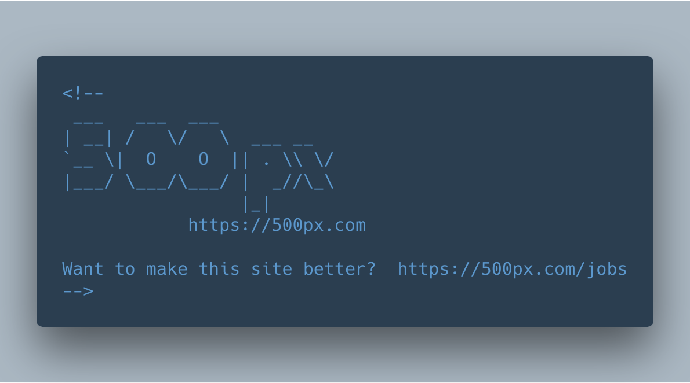
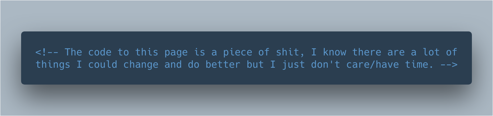
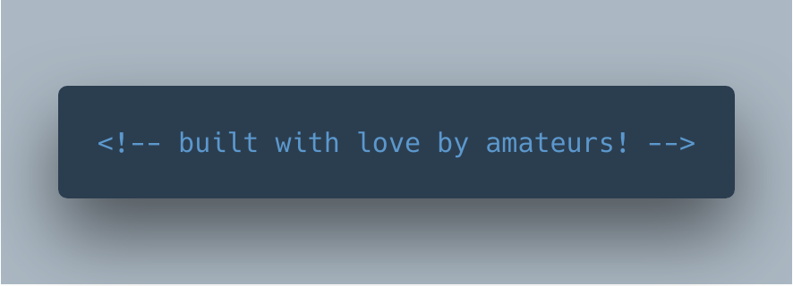

<h1 align="center">֎ COMMENTUS ֍</h1>  

Did you know that `HTML` comments are actual elements? You can create them just like you would a regular ol' `div` and even update the text inside the element. 

Inspired by humorous comments like the ones below:

<center> 
  
  <p>500px.com</p>
  
  <p>maddox.xmission.com</p>
  
  <p>digg.com</p>
</center>

### Usage
```javascript
let options =
{ position: [ 'first' | 'last' | 'target' ] // default 'first'
, target: [ '#query' | Node ] // only valid when position is 'target'
};

let comment = new Commentus('dynamic comments FTW!', options);

comment.update('made you look!');
```

<script src="dist/commentus.min.js"></script>
<script>
  (function()
  { var jokes =
    [ [ 'Knock knock.'
      , 'Race condition.'
      , 'Who\'s there?'
      ]
    , [ 'What part of the bathroom can handle water concurrently?'
      , 'async'
      ]
    , [ 'What\'s the difference between a dentist and a web page?'
      , 'The doctype'
      ]
    , [ 'How long does a loop last?'
      , 'For a while'
      ]
    , [ 'Why don\'t people laugh when I tell this joke?'
      , 'It isn\'t funny, it is just a regular expression.'
      ]
    ];

    for(var i = 0; i < jokes.length; ++i)
    {
      var _joke = jokes[i];

      for(var j = 1; j < _joke.length; ++j)
      {
        if(j % 2 == 1)
        {
          _joke.splice(j, 0, '...');
          ++j;
        }
      }

      var string = _joke[0];

      for(var j = 1; j < _joke.length; ++j)
      {
        string += '\n' + _joke[j];
        _joke[j] = string;
      }
    }

    var joke;

    var _commentus = new Commentus();

    function nextTick()
    { if(joke.step == jokes[joke.index].length - 1)
      { pickRandomJoke();
      }
      else
      { ++joke.step;
      }
      update();
    }

    function pickRandomJoke()
    { joke =
      { index: Math.floor(Math.random() * jokes.length)
      , step: 0
      };
    }

    function update()
    { _commentus.update(jokes[joke.index][joke.step]);
    }

    pickRandomJoke();
    update();

    setInterval(nextTick, 1500);
  })();
</script>